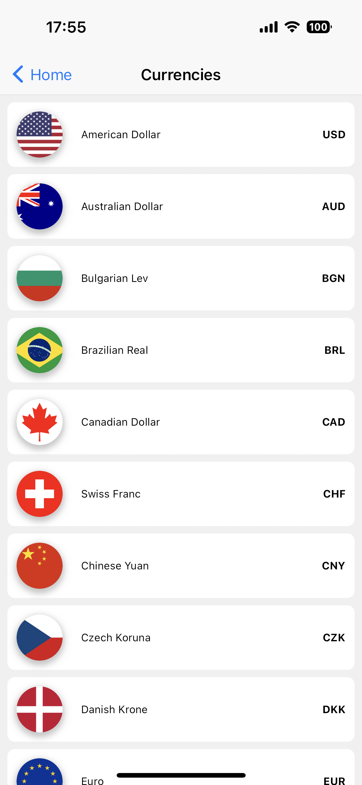
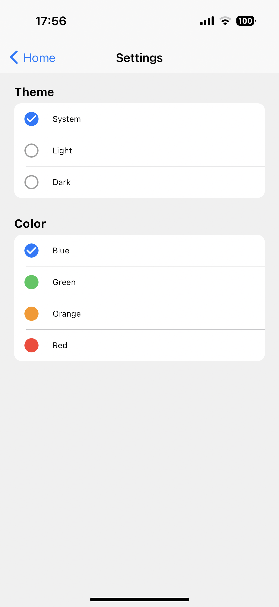

# Currency Converter
Minimalistic mobile app, that allows you to convert amount to another currency. 
Written in Flutter, as a project for Programming Window and Mobile Application classes.

## Features
- Calculator
- Actual exchange rates from [Frankfurter API](https://www.frankfurter.app/).
- Light and dark mode, color themes
- Saving theme settings and currency choice in the local storage

## Screenshots

    
    
    

 

    
    
    

